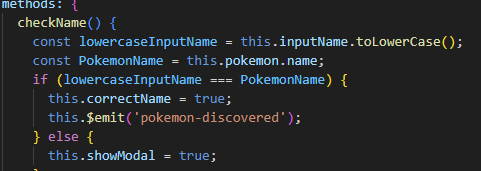
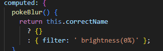

- [Desafío Poke Api](#desafío-poke-api)
  - [Requerimientos](#requerimientos)
  - [Pasos](#pasos)
  - [Resultado](#resultado)

# Desafío Poke Api

- Descripción

Entre los capítulos de Pokémon aparecía un momento de interacción con los espectadores
donde se debía adivinar el nombre de un pokemon viendo solo la silueta.
La aplicación que deberás construir sigue esta misma temática mostrando 20 pokemones
cuyas imágenes poseen en primera instancia un filtro que no deja ver con claridad cuál
pokémon es.

  ---

## Requerimientos

1. Usar las directivas para enlazar variables del estado con el template.

2. Importar y ocupar componentes hijos que reciban datos a través de props.

3. Renderizar dinámicamente componentes hijos usando el v-for.

4. Usar los eventos para agregar interacciones en la aplicación y enlazarlos con métodos locales.

5. Comunicar componentes hijos con su padre para la ejecución de un método.

6. Usar la renderización condicional de elementos para mostrar u ocultar contenido.

7. Asignar condicionalmente estilos o clases por medio del style y class binding.

8. Utilizar Axios para el consumo de la API.

9. Hacer uso del ciclo de vida para ejecutar código al cargar la aplicación.

10. Utilizar computed properties para el procesamiento de datos del estado. 

   ---

## Pasos

1. Usamos las directivas para enlazar variables del estado con el template.

2. Importamos y ocupamos componentes hijos que reciban datos a través de props.

3. Renderizamos dinámicamente componentes hijos usando el v-for.

4. Usamos los eventos para agregar interacciones en la aplicación.

5. Comunicamos componentes hijos con su padre para la ejecución de un método.

6. Usamos la renderización condicional de elementos para mostrar u ocultar contenido.

7. Asignamos condicionalmente estilos o clases por medio del style y class binding.

8. Utilizamos Axios para el consumo de la API.

9.  Hacemos uso del ciclo de vida para ejecutar código al cargar la aplicación.

10.   Utilizamos computed properties para el procesamiento de datos del estado. 

---

## Resultado

